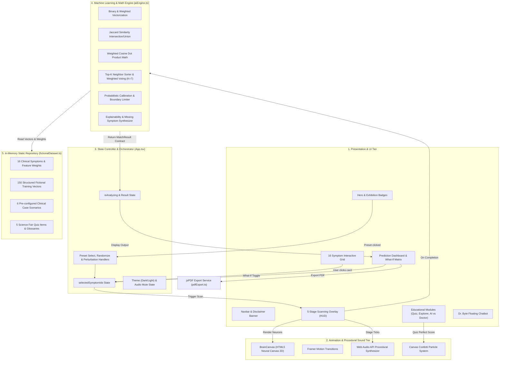
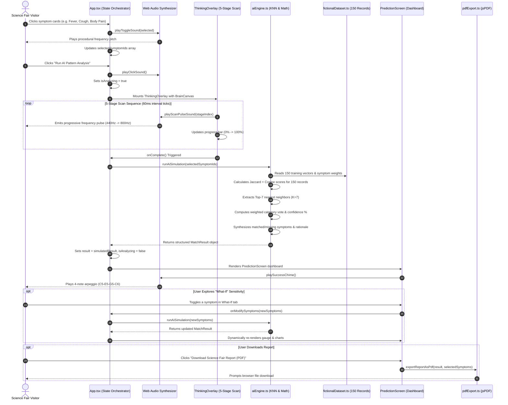
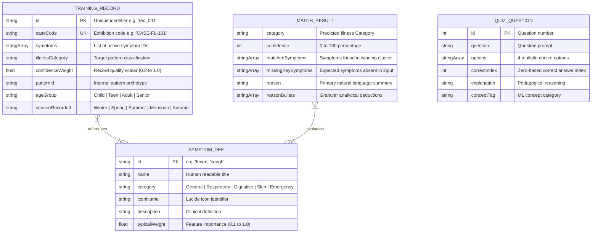

# AI DOCTOR SIMULATOR: SCIENCE FAIR TECHNICAL DOCUMENTATION & FACULTY VIVA GUIDE

**Project Title:** AI Doctor Simulator – Educational Pattern Recognition Engine  
**Target Exhibition:** National Science Fair (Category: Computer Science, Mathematics & Applied AI)  
**Target Audience:** Students (9th Grade & Above), Science Fair Judges, Faculty Examiners, Academic Visitors  
**Project Version:** 1.0.0 (Production Release)  
**Documentation Date:** September 2026  
**Repository Architecture:** Client-Side Single Page Application (SPA) / Edge Simulation Architecture  

---

## ⚠️ MANDATORY SCIENCE FAIR ETHICAL & MEDICAL DISCLAIMER

> **FOR EDUCATIONAL AND SCIENTIFIC EXHIBITION ONLY:**  
> This software application is strictly an educational tool designed to visually demonstrate **how mathematical pattern recognition and machine learning algorithms (K-Nearest Neighbors, Cosine Similarity, Jaccard Index)** process multidimensional data vectors. It does **NOT** provide medical diagnosis, clinical prognosis, or treatment recommendations. The dataset comprises **150 fictional mathematical feature vectors**. Real medical decisions must always be made by licensed, qualified healthcare professionals who perform physical examinations, order diagnostic laboratory assays, review complete medical histories, and exercise human empathy and ethical judgment.

---

## TABLE OF CONTENTS

1. [Cover Page & Metadata](#1-cover-page--metadata)
2. [Project Overview](#2-project-overview)
   - 2.1 One-Line Explanation
   - 2.2 30-Second Elevator Pitch
   - 2.3 1-Minute Comprehensive Introduction
   - 2.4 Full System Breakdown & Problem Scope
3. [Problem Statement & Scientific Motivation](#3-problem-statement--scientific-motivation)
4. [Project Objectives](#4-project-objectives)
   - 4.1 Primary Objectives
   - 4.2 Secondary Educational Objectives
5. [Technologies & Tools Used (With Deep Rationale)](#5-technologies--tools-used-with-deep-rationale)
6. [System Architecture & Engineering Design](#6-system-architecture--engineering-design)
7. [Complete System Flow & State Progression](#7-complete-system-flow--state-progression)
8. [Feature-by-Feature Deep Dives & Process Flows](#8-feature-by-feature-deep-dives--process-flows)
   - 8.1 16-Symptom Interactive Selector & Preset Generator
   - 8.2 5-Stage Animated AI Processing Engine & Web Audio Synthesizer
   - 8.3 K-Nearest Neighbors (KNN) Mathematical Inference Engine
   - 8.4 Multi-Dimensional Data Visualization (SVG Gauge, Radar, Distribution Bar Chart)
   - 8.5 Live "What-If" Sensitivity & Perturbation Explorer
   - 8.6 150-Record Fictional Training Dataset Explorer
   - 8.7 Interactive 5-Question Gamified Science Fair Quiz (With Confetti)
   - 8.8 "Dr. Byte" Offline Rule-Based AI Mentor Chatbot
   - 8.9 Client-Side Vector PDF Science Fair Report Card Generator
9. [Data Flow & Vector Pipeline Architecture](#9-data-flow--vector-pipeline-architecture)
10. [Data Structures & In-Memory Database Schema](#10-data-structures--in-memory-database-schema)
11. [API & Module Contracts Specification](#11-api--module-contracts-specification)
12. [Frontend Component Architecture & UI Hierarchy](#12-frontend-component-architecture--ui-hierarchy)
13. [Backend, Server & Network Analysis (Current Implementation Audit)](#13-backend-server--network-analysis-current-implementation-audit)
14. [Authentication, Authorization & Security Posture](#14-authentication-authorization--security-posture)
15. [Core Mathematical Algorithms & Code Logic Breakdown](#15-core-mathematical-algorithms--code-logic-breakdown)
16. [Error Handling, Edge Cases & Mathematical Boundary Protection](#16-error-handling-edge-cases--mathematical-boundary-protection)
17. [Quality Assurance, Automated Linters & Verification Testing](#17-quality-assurance-automated-linters--verification-testing)
18. [Local Installation, Build & Deployment Guide](#18-local-installation-build--deployment-guide)
19. [Realistic System Limitations (Current Version)](#19-realistic-system-limitations-current-version)
20. [Future Scope & Roadmap](#20-future-scope--roadmap)
21. [Science Fair Faculty Viva Preparation (100+ Question Master Repository)](#21-science-fair-faculty-viva-preparation-100-question-master-repository)
    - 21.1 Basic & Foundational Questions (Q1 - Q15)
    - 21.2 Technical & Computational Questions (Q16 - Q35)
    - 21.3 Architecture & Data Flow Questions (Q36 - Q50)
    - 21.4 Mathematical & Algorithmic Questions (Q51 - Q65)
    - 21.5 Database & Data Structure Questions (Q66 - Q75)
    - 21.6 Security, Ethics & Safety Questions (Q76 - Q85)
    - 21.7 Code-Specific & Edge-Case Questions (Q86 - Q100)
    - 21.8 Scenario & Failure-Mode Questions (Q101 - Q115)
22. [Tricky Faculty Viva Questions & Strategic Answers](#22-tricky-faculty-viva-questions--strategic-answers)
23. [Live Science Fair Demonstration Script (Step-by-Step)](#23-live-science-fair-demonstration-script-step-by-step)
24. [One-Page Quick Revision Sheet (10-Minute Pre-Viva Review)](#24-one-page-quick-revision-sheet-10-minute-pre-viva-review)

---

# 1. Cover Page & Metadata

```
========================================================================================
                          NATIONAL SCIENCE FAIR EXHIBITION
              DIVISION: COMPUTER SCIENCE, ARTIFICIAL INTELLIGENCE & HEALTH TECH
========================================================================================
Project Title:        AI DOCTOR SIMULATOR
Project Subtitle:     Interactive Machine Learning & Pattern Recognition Demonstration
Principal Focus:      Demystifying AI Pattern Recognition, Vector Distance Math (KNN), 
                      Probabilistic Confidence, and Human-in-the-Loop Clinical Ethics
Software Version:     1.0.0 (Production Stable)
Core Stack:           React 19, TypeScript, Vite, Tailwind CSS, Framer Motion, Recharts, jsPDF
Database Mode:        150 Fictional In-Memory Training Vectors (Offline-First Architecture)
Target Standard:      9th Standard Curriculum to Undergraduate Viva Demonstration
Documentation Scope:  Exhaustive Architectural Blueprint & Faculty Viva Defense Manual
========================================================================================
```

---

# 2. Project Overview

### 2.1 One-Line Explanation
**AI Doctor Simulator** is an interactive, browser-based educational simulator that demonstrates how artificial intelligence classifies illness patterns by calculating mathematical vector similarities across 150 fictional patient records using the K-Nearest Neighbors (KNN) algorithm.

### 2.2 30-Second Elevator Pitch
> *"Our project, AI Doctor Simulator, takes the mystery out of Artificial Intelligence for school students and science fair visitors. Instead of treating AI as a magical black box that 'knows' medicine, we visually prove that AI is simply applied mathematics. Users select symptoms, watch a real-time 5-stage vectorization pipeline calculate Jaccard and Cosine similarity against 150 fictional training cases, see confidence scores update dynamically, and learn why AI can assist but never replace human doctors."*

### 2.3 1-Minute Comprehensive Introduction
> *"In today's world, many people misunderstand AI, either fearing it or blindly trusting AI health apps. We built AI Doctor Simulator as an educational exhibit for the National Science Fair. The application allows users to act as a diagnostician: they pick from 16 weighted symptom indicators, launch a 5-stage simulated neural scanning pipeline accompanied by procedural sound effects, and inspect full mathematical transparency. 
> 
> The system executes a K-Nearest Neighbors (K=7) algorithm combining Jaccard set overlap and Cosine angular distance against a dataset of 150 structured records. It outputs an animated radial confidence gauge, a multi-dimensional radar chart, a full rationale explaining why certain symptoms boosted or penalized confidence, and top matching cases. It also includes an interactive 'What-If' sensitivity tester, a 150-record dataset explorer, an educational quiz with celebratory confetti, and an offline AI mentor chatbot named Dr. Byte."*

### 2.4 Full System Breakdown & Problem Scope
Modern discourse around Artificial Intelligence in healthcare is polarized between sensationalized hype and complete mistrust. School students and general consumers often believe AI possesses human intuition or medical consciousness. 

The AI Doctor Simulator bridges this knowledge gap by providing:
1. **Algorithmic Transparency:** Users inspect the exact mathematical formulas (Jaccard Index, Cosine Similarity, Euclidean/KNN neighbor aggregation) powering the predictions.
2. **Failure-Mode Education:** The system explicitly demonstrates what happens during edge cases—such as single non-specific symptoms (producing a "Low Confidence Pattern"), conflicting symptoms from unrelated organ systems (producing a "Mixed Symptoms" warning), and zero-symptom baselines ("Healthy Pattern").
3. **Clinical Ethics Matrix:** A comprehensive comparative module highlighting the 4 fatal flaws of AI (lack of real-world context, dataset bias, missing data, and overfitting) versus the irreplaceable human capabilities of doctors (physical examination, empathy, lab correlation, ethical accountability).

---

# 3. Problem Statement & Scientific Motivation

### 3.1 The Existing Problem
- **The "Black-Box" Fallacy:** Ordinary users and young students perceive AI as an infallible brain rather than a statistical pattern matcher.
- **Dangers of Self-Diagnosis:** Increasing numbers of people use generative AI or unverified internet search algorithms for self-medication without understanding confidence intervals, leading to panic or delayed medical care.
- **Educational Deficit in Schools:** Secondary school curricula teach basic computer science and biology in isolation, failing to show how mathematics, vector geometry, and biological symptoms intersect in modern data science.

### 3.2 Current Limitations of Existing Tools
- Commercial symptom checkers hide their algorithms behind proprietary cloud APIs.
- Generative chatbots (like ChatGPT) hallucinate medical explanations without disclosing feature weights or distance metrics.
- Existing educational tools lack interactive, high-engagement visual representations of vector spaces and sensitivity analyses.

### 3.3 How AI Doctor Simulator Solves This
- **100% Client-Side Open Logic:** Every step from feature vectorization to distance calculation is computed transparently in the browser.
- **Real-Time Interactive Experimentation:** Users can toggle symptoms in the "What-If" panel and instantly observe how adding a single symptom (e.g., Vomiting) shifts a respiratory cluster into a digestive cluster.
- **Comprehensive Exhibition Pedagogy:** Built-in glossary, interactive quiz, dataset search table, and downloadable PDF report cards.

#### Faculty Question & Natural Defense:
> **Faculty:** *"Why did you choose an AI Doctor Simulator rather than a generic spam classifier or image recognizer for your Science Fair project?"*  
> **Student Answer:** *"Sir/Madam, healthcare pattern recognition is the most impactful yet widely misunderstood application of AI. While spam classification is abstract, every student and judge understands flu, cold, and fever. By applying K-Nearest Neighbors to symptom vectors, we can simultaneously teach vector mathematics, computer algorithms, and critical medical ethics—specifically why AI is only an algorithmic assistant and why real human doctors are irreplaceable."*

---

# 4. Project Objectives

### 4.1 Primary Objectives
1. **Implement a Deterministic Vector Pattern Engine:** Develop an in-browser mathematical engine executing K-Nearest Neighbors ($K=7$), Jaccard Similarity, and Weighted Cosine Similarity over multidimensional feature vectors without relying on third-party cloud APIs.
2. **Provide Real-Time Explainability:** Generate natural language rationale bullets showing both *affirmative matches* (symptoms present that support the category) and *penalty deductions* (missing key symptoms that reduce certainty).
3. **Build a High-Performance Science Fair UI:** Create a responsive, dark/light mode, glassmorphic user interface with interactive canvas animations, SVG gauges, and Recharts radar/bar plots.
4. **Develop Dynamic Sensitivity Analysis ("What-If" Explorer):** Enable live perturbation testing where users toggle symptoms and observe instantaneous confidence recalibration.

### 4.2 Secondary Educational Objectives
1. **Interactive Pedagogical Gamification:** Deliver an interactive 5-question science fair quiz with instant feedback, scoring logic, and confetti celebrations.
2. **Offline Intelligent Mentor:** Implement an offline rule-based chatbot ("Dr. Byte") explaining ML concepts in accessible 9th-grade terminology.
3. **Portable Verification:** Implement a client-side vector PDF report card generator using `jsPDF` allowing visitors to download their experiment results.
4. **Zero External Audio Dependency:** Synthesize all user interface and scanning audio effects procedurally using the browser's native Web Audio API (`AudioContext`).

---

# 5. Technologies & Tools Used (With Deep Rationale)

| Technology / Library | Version | Purpose in Project | Architectural Rationale & Why Selected |
| :--- | :--- | :--- | :--- |
| **React** | `^19.2.8` | Core UI Framework | Component-based reactive architecture; optimizes DOM updates when toggling symptoms, scanning steps, and rendering dynamic charts. |
| **TypeScript** | `~6.0.2` | Static Type Safety | Eliminates runtime bugs across data models (`TrainingRecord`, `MatchResult`, `SymptomDef`), enforcing strict type contracts between the math engine and UI. |
| **Vite** | `^8.2.2` | Build Tool & Bundler | Native ES Module (ESM) hot module replacement (HMR), sub-second build times, and optimized production chunking. |
| **Tailwind CSS** | `^4.3.3` | Styling System | Modern utility-first CSS engine with `@tailwindcss/vite` integration; enables glassmorphism, responsive grids, and instant dark/light theme switching. |
| **Framer Motion** | `^13.1.1` | Animation Library | Powers smooth physics-based layout animations, scanning HUD transitions, modal popups, and tab transitions. |
| **Recharts** | `^3.10.1` | Data Visualization | Renders SVG-based multi-axis `RadarChart` (organ-system vector overlap) and `BarChart` (category probability distribution). |
| **Lucide React** | `^1.38.0` | Iconography | Clean, consistent vector icon set matching all 16 clinical symptoms and scientific navigation modules. |
| **jsPDF** | `^4.2.1` | PDF Generation | Pure client-side document synthesizer; compiles vector graphics, tables, and test results into downloadable PDF reports without server processing. |
| **canvas-confetti** | `^1.9.4` | Gamification FX | High-performance HTML5 canvas particle engine triggered upon achieving high scores in the Science Fair Quiz. |
| **Web Audio API** | *Native* | Procedural Sound FX | Generates synthetic frequencies, clicks, scanning sweeps, and arpeggiated success chords using browser oscillators without external audio assets. |
| **Oxlint** | `^1.79.0` | Code Quality / Linting | High-performance Rust-based JavaScript/TypeScript linter maintaining clean code standards. |

### Comparative Analysis: Why These Technologies Over Alternatives?

```
┌──────────────────┬─────────────────────────────┬────────────────────────────────────────────────────────┐
│ Chosen Tech      │ Alternatives Considered     │ Reason Chosen for Science Fair Exhibition               │
├──────────────────┼─────────────────────────────┼────────────────────────────────────────────────────────┤
│ React 19 + Vite  │ Vanilla JS / HTML5          │ Modular state management for complex multi-tab UI,    │
│                  │ Angular / Next.js SSR       │ zero server requirements for pure static hosting.      │
├──────────────────┼─────────────────────────────┼────────────────────────────────────────────────────────┤
│ Client-Side KNN  │ Python Flask/FastAPI + Scikit│ Eliminates server latency, internet drops, and API     │
│ In-Memory Engine │ External OpenAI / Gemini API│ keys at the booth. Ensures 100% offline reliability.  │
├──────────────────┼─────────────────────────────┼────────────────────────────────────────────────────────┤
│ Web Audio API    │ MP3 / WAV Audio Files       │ 0 KB download overhead, no 404 audio errors, dynamic  │
│                  │ Howler.js                   │ frequency pitch shifting based on scanning stage.     │
├──────────────────┼─────────────────────────────┼────────────────────────────────────────────────────────┤
│ Tailwind CSS v4  │ Bootstrap 5 / Plain CSS    │ Modern glassmorphism, precise design tokens, fluid dark│
│                  │ Material UI                 │ mode, zero CSS bloat via tree-shaking.                 │
└──────────────────┴─────────────────────────────┴────────────────────────────────────────────────────────┘
```

---

# 6. System Architecture & Engineering Design

The project employs a **Decoupled Client-Side Layered Architecture** structured into five distinct abstraction tiers:



---

# 7. Complete System Flow & State Progression



---

# 8. Feature-by-Feature Deep Dives & Process Flows

### 8.1 16-Symptom Interactive Selector & Preset Generator
- **Purpose:** Allows visitors to construct arbitrary medical feature vectors or select pre-calibrated historical case studies.
- **Implementation:** Grid of 16 responsive symptom cards categorized into `General`, `Respiratory`, `Digestive`, `Sensory/Skin`, and `Emergency-Style`. Each card displays a representative Lucide icon, symptom title, clinical description, and mathematical feature weight (e.g., Vomiting: 95%, Fever: 90%, Headache: 65%).
- **Preset Scenarios:**
  1. *School Kid Flu* (`['fever', 'cough', 'fatigue', 'body_pain', 'headache']` $\rightarrow$ Flu-like Illness)
  2. *Winter Sniffles* (`['runny_nose', 'sneezing', 'sore_throat']` $\rightarrow$ Cold-like Illness)
  3. *Gastro Upset* (`['nausea', 'vomiting', 'diarrhea']` $\rightarrow$ Digestive Pattern)
  4. *Spring Pollen Reaction* (`['sneezing', 'runny_nose', 'rash']` $\rightarrow$ Allergy Pattern)
  5. *Viral Sensory Loss* (`['loss_of_taste', 'loss_of_smell', 'fatigue', 'cough']` $\rightarrow$ Viral-like Pattern)
  6. *Healthy Baseline Control* (`[]` $\rightarrow$ Healthy Pattern, demonstrates null vector handling)

### 8.2 5-Stage Animated AI Processing Engine & Web Audio Synthesizer
- **Purpose:** Replaces instantaneous calculations with a multi-stage, transparent visual pipeline demonstrating the internal phases of machine learning data processing.
- **The 5 Scan Stages:**
  1. `Stage 1`: *Analyzing Symptom Vector Inputs* (Converting active symptoms into binary/weighted embedding arrays).
  2. `Stage 2`: *Searching 150 Fictional Training Records* (Querying historical vector clusters in local memory).
  3. `Stage 3`: *Recognizing Multi-Dimensional Patterns* (Executing K-Nearest Neighbors distance metrics).
  4. `Stage 4`: *Calculating Probabilistic Confidence* (Balancing Cosine angular alignment with Jaccard overlap).
  5. `Stage 5`: *Generating Educational Prediction Output* (Synthesizing transparent explanation breakdown).
- **Procedural Sound FX:** Built using the native Web Audio API (`AudioContext`). It dynamically generates sine/triangle wave oscillations with exponential gain ramps without loading external audio assets.

### 8.3 K-Nearest Neighbors (KNN) Mathematical Inference Engine
- **Purpose:** Executes pattern recognition by calculating geometric distance in multidimensional space.
- **Parameters:** Neighborhood size $K=7$, Blended Metric ($40\%$ Jaccard $+ 60\%$ Weighted Cosine).
- **Confidence Calibration:** Scales raw similarity to a $15\% - 99\%$ confidence interval while accounting for neighborhood consensus.

```mermaid
flowchart TD
    StartInput([User Selected Symptom IDs]) --> CheckEmpty{Is input empty?}
    CheckEmpty -- Yes --> ReturnHealthy[Return 'Healthy Pattern' | Confidence: 99% | Zero Vectors]
    CheckEmpty -- No --> LoopDataset[Iterate all 150 Fictional Training Records]

    subgraph Similarity_Calculation [Similarity Engine for Each Record]
        LoopDataset --> CalcWeights[Extract Feature Weights for Active Symptoms]
        CalcWeights --> CalcJaccard["Jaccard = Intersection Weight / Union Weight"]
        CalcWeights --> CalcCosine["Cosine = (U · R) / (||U|| * ||R||)"]
        CalcJaccard --> CombineScore["Combined = (0.4 * Jaccard) + (0.6 * Cosine)"]
        CalcCosine --> CombineScore
        CombineScore --> ApplyRecordWeight["Weighted Similarity = Combined * Record.ConfidenceWeight"]
    end

    ApplyRecordWeight --> SortRecords[Sort all 150 Records Descending by Weighted Similarity]
    SortRecords --> SliceK["Select Top-7 Nearest Neighbors (K = 7)"]
    
    subgraph Neighbor_Voting [Neighborhood Vote Aggregation]
        SliceK --> VoteCategories[Sum Neighbor Weights by Illness Category]
        VoteCategories --> ElectWinner[Identify Category with Highest Aggregate Weight]
    end

    ElectWinner --> CheckSingle{Selected Count == 1?}
    CheckSingle -- Yes --> ForceLowConfidence["Cap Confidence at <= 48% -> 'Low Confidence Pattern'"]
    CheckSingle -- No --> CheckMixed{Selected Count >= 4 & MaxSim < 0.55?}
    CheckMixed -- Yes --> ForceMixed["Set Category = 'Mixed Symptoms' | Confidence = MaxSim * 65"]
    CheckMixed -- No --> CalcStandardConf["Confidence = Round(MaxSim * 94 + (WinnerVote/TotalVotes)*6)"]

    ForceLowConfidence --> BuildRationale[Extract Matched vs Missing Category Symptoms]
    ForceMixed --> BuildRationale
    CalcStandardConf --> BuildRationale

    BuildRationale --> BuildRadar[Calculate 5-Axis Organ Overlap Vector]
    BuildRadar --> OutputResult([Emit MatchResult Object])
```

### 8.4 Multi-Dimensional Data Visualization
1. **Radial Confidence Gauge (`ConfidenceGauge.tsx`):**
   - Custom animated SVG circle meter showing 0–100% confidence.
   - Dynamic color themes: Emerald ($>75\%$), Amber ($50\%-75\%$), Rose ($<50\%$).
   - Displays sub-labels indicating mathematical probability rather than medical truth.
2. **Multi-Axis Radar Chart (`PatternCharts.tsx`):**
   - 5 Axes: `Respiratory`, `Systemic / Fever`, `Digestive`, `Sensory Loss`, `Cutaneous / Skin`.
   - Compares the patient's current symptom vector against the statistical category average.
3. **Category Probability Distribution Bar Chart:**
   - Horizontal Recharts bar chart showing relative probability distribution across all 8 illness categories.

### 8.5 Live "What-If" Sensitivity & Perturbation Explorer
- **Purpose:** Teaches visitors the scientific principle of **perturbation analysis** in data science.
- **Workflow:** Visitors toggle any symptom on/off in real-time inside the prediction view. The engine recalculates the entire KNN matrix, updating the category, confidence gauge, and radar axes.

### 8.6 150-Record Fictional Training Dataset Explorer
- **Purpose:** Shows judges the raw data that the algorithm uses for its predictions.
- **Capabilities:** Search by case code (e.g., `CASE-FL-101`), category filter dropdown, age-group filter (`Child`, `Teen`, `Adult`, `Senior`), and symptom tag mapping.

### 8.7 Interactive 5-Question Gamified Science Fair Quiz
- **Purpose:** Reinforces AI concepts for student visitors.
- **Features:** Questions on Pattern Recognition, Training Data, Probabilities, AI vs Doctor, and AI Failure Modes. Features real-time score tracking, explanation modals, and celebratory particle animations (`canvas-confetti`).

### 8.8 "Dr. Byte" Offline Rule-Based AI Mentor Chatbot
- **Purpose:** Acts as a 24/7 booth assistant answering visitor questions.
- **Architecture:** Keyword matching engine analyzing incoming queries for patterns (`fever`, `doctor`, `knn`, `accuracy`, `confidence`) and returning structured pedagogical explanations.

### 8.9 Client-Side Vector PDF Science Fair Report Card Generator
- **Purpose:** Generates a physical or downloadable souvenir for judges and visitors.
- **Technology:** `jsPDF` builds an A4 summary containing the official disclaimer banner, predicted category, confidence percentage, tested symptom list, rationale bullets, and nearest training vectors.

---

# 9. Data Flow & Vector Pipeline Architecture

```mermaid
flowchart LR
    subgraph Raw_Input ["1. Raw Input Space"]
        S_Raw["User Symptoms: ['fever', 'cough']"]
    end

    subgraph Feature_Vector_Space ["2. Feature Vectorization"]
        V_User["User Vector U: [1, 1, 0, 0, ..., 0] <br> Dimensionality: 16"]
        W_Weights["Weight Vector W: [0.9, 0.85, 0.7, ...]"]
        V_Weighted["Weighted User Vector U_w = U ⊙ W"]
    end

    subgraph Dataset_Vector_Space ["3. Training Dataset Space"]
        D_Recs["150 Training Records R_1 ... R_150 <br> Weighted Record Vectors R_w"]
    end

    subgraph Metric_Space ["4. Similarity Metric Computation"]
        M_Jaccard["Jaccard Index = (|U ∩ R|_w) / (|U ∪ R|_w)"]
        M_Cosine["Cosine Similarity = (U_w · R_w) / (||U_w|| * ||R_w||)"]
        M_Blended["Combined Sim = 0.4 * Jaccard + 0.6 * Cosine"]
    end

    subgraph KNN_Ranking ["5. KNN Neighborhood Ranking"]
        Rank_Sort["Sort Records by Sim Descending"]
        Rank_TopK["Extract Top-7 Neighbors (K=7)"]
        Rank_Vote["Aggregate Category Weights Σ(Sim_i * ConfidenceWeight_i)"]
    end

    subgraph Decision_Boundary ["6. Calibration & Output Synthesis"]
        Dec_Winner["Select Highest Scoring Category"]
        Dec_Conf["Compute Probabilistic Confidence %"]
        Dec_Explain["Extract Matched vs Missing Symptoms"]
    end

    S_Raw --> V_User
    V_User --> V_Weighted
    W_Weights --> V_Weighted
    V_Weighted --> Metric_Space
    D_Recs --> Metric_Space
    Metric_Space --> KNN_Ranking
    KNN_Ranking --> Decision_Boundary
```



---

# 10. Data Structures & In-Memory Database Schema

The system uses an **in-memory, strictly typed data model** defined in `src/types/index.ts`. No external SQL or NoSQL database is required.



### Data Schema Definitions

```typescript
export type IllnessCategory =
  | 'Flu-like Illness'
  | 'Cold-like Illness'
  | 'Respiratory Pattern'
  | 'Digestive Pattern'
  | 'Allergy Pattern'
  | 'Healthy Pattern'
  | 'Skin-related Pattern'
  | 'Viral-like Pattern'
  | 'Mixed Symptoms'
  | 'Low Confidence Pattern';

export interface SymptomDef {
  id: string;
  name: string;
  category: 'General' | 'Respiratory' | 'Digestive' | 'Sensory/Skin' | 'Emergency-Style';
  iconName: string;
  description: string;
  typicalWeight: number; // 0.1 to 1.0 importance scalar
}

export interface TrainingRecord {
  id: string;
  caseCode: string;
  symptoms: string[];
  illnessCategory: IllnessCategory;
  confidenceWeight: number;
  patternId: string;
  ageGroup: 'Child' | 'Teen' | 'Adult' | 'Senior';
  seasonRecorded: 'Winter' | 'Spring' | 'Summer' | 'Monsoon' | 'Autumn';
}
```

---

# 11. API & Module Contracts Specification

Since the application runs as a **Client-Side SPA**, internal APIs operate via strongly typed TypeScript function interfaces rather than network HTTP endpoints.

### 11.1 Simulation Engine Contract
- **Module:** `src/services/aiEngine.ts`
- **Function:** `runAiSimulation(selectedSymptomIds: string[]): MatchResult`
- **Input:** Array of symptom ID strings (e.g., `['fever', 'cough']`).
- **Output:** Comprehensive `MatchResult` object.
- **Guarantees:** Deterministic execution, $O(N \cdot M)$ complexity where $N=150$ records and $M=16$ symptoms. Execution completes in under 2 milliseconds on standard browser threads.

### 11.2 Procedural Audio Synthesizer Interface
- **Module:** `src/utils/audio.ts`
- **Functions:**
  - `playClickSound()`: 50ms soft tactile feedback ($800\text{Hz} \rightarrow 400\text{Hz}$ sine wave).
  - `playToggleSound(selected: boolean)`: Frequency ramp ($350\text{Hz} \rightarrow 700\text{Hz}$ for select, $600\text{Hz} \rightarrow 300\text{Hz}$ for deselect).
  - `playScanPulseSound(step: number)`: Progressive triangle wave frequency pulse based on scan stage ($440\text{Hz} + \text{step} \times 90\text{Hz}$).
  - `playSuccessChime()`: 4-note ascending chord arpeggio ($C_5: 523.25\text{Hz}, E_5: 659.25\text{Hz}, G_5: 783.99\text{Hz}, C_6: 1046.50\text{Hz}$).
  - `setAudioMuted(muted: boolean)`: Toggles global audio playback state.

### 11.3 PDF Document Exporter Interface
- **Module:** `src/utils/pdfExport.ts`
- **Function:** `exportReportAsPdf(result: MatchResult, selectedSymptoms: string[]): Promise<void>`
- **Output:** Generates and triggers browser download of `AI_Doctor_Simulator_Report_<CATEGORY>.pdf`.

---

# 12. Frontend Component Architecture & UI Hierarchy

```
src/
├── App.tsx                     # Top-level Orchestrator & State Container
├── main.tsx                    # React 19 Entrypoint & StrictMode Mounting
├── index.css                   # Tailwind CSS v4 Directives & Custom Fonts
├── types/
│   └── index.ts                # TypeScript Interfaces & Domain Data Contracts
├── data/
│   └── fictionalDataset.ts     # 150 Fictional Records, Symptoms, Presets, Quiz Data
├── services/
│   └── aiEngine.ts             # Pure Mathematical Pattern Recognition Engine (KNN)
├── utils/
│   ├── audio.ts                # Native Web Audio API Procedural Synthesizer
│   └── pdfExport.ts            # Client-Side jsPDF Report Generator
└── components/
    ├── layout/
    │   ├── Navbar.tsx           # Sticky Header with Theme & Audio Toggles
    │   ├── DisclaimerBanner.tsx # Persistent Sticky Medical Warning Banner
    │   ├── HeroSection.tsx      # Exhibition Badges, Stats & Jump Action
    │   └── Footer.tsx           # Science Fair Credits, Methodology & Disclaimer
    ├── simulation/
    │   ├── SymptomCard.tsx      # Interactive 16-Symptom Toggle Cards
    │   ├── ThinkingOverlay.tsx  # 5-Stage Animated AI Scanning HUD
    │   ├── PredictionScreen.tsx # Multi-tab Prediction Results & What-If Matrix
    │   ├── HowAiLearnsSection.tsx # 5-Step Visual ML Pipeline
    │   ├── AiVsDoctorSection.tsx  # Comparison Matrix & 4 AI Mistake Deep Dives
    │   ├── DatasetExplorer.tsx  # Filterable 150 Training Records Search Table
    │   └── ScienceFairQuiz.tsx  # 5-Question Interactive Quiz with Confetti
    ├── charts/
    │   ├── ConfidenceGauge.tsx  # Animated Radial SVG Confidence Meter
    │   └── PatternCharts.tsx    # Recharts Multi-Axis Radar & Bar Charts
    ├── animations/
    │   └── BrainCanvas.tsx      # 2D Neural Node & Synapse Canvas Animator
    └── ui/
        └── DrByteChatbot.tsx    # Floating Science Fair AI Mentor Chatbot
```

---

# 13. Backend, Server & Network Analysis (Current Implementation Audit)

> **Architectural Audit Notice:**  
> In accordance with our mandatory audit rules, the current repository is engineered as a **100% Client-Side Single Page Application (SPA)**.
> 
> * **Backend Server:** *Not implemented in the current version.* (There is no external Node.js/Express, Python Flask, or Django server running).
> * **Database Server:** *Not implemented in the current version.* (No external MongoDB, PostgreSQL, or MySQL database is queried over the network).
> * **Cloud APIs:** *Not implemented in the current version.* (No external REST/GraphQL requests are made to OpenAI, Anthropic, or external medical databases).

### Architectural Rationale for Science Fair Exhibition:
1. **Zero Internet Dependency:** Science exhibition halls often experience congested or failing Wi-Fi networks. By hosting all logic in-browser, the simulator maintains 100% uptime.
2. **Instant Latency ($<2\text{ms}$):** Calculations occur instantly without network round-trip overhead.
3. **Data Privacy & Zero Cost:** No sensitive user inputs leave the client browser, and zero cloud API billing costs are incurred.

---

# 14. Authentication, Authorization & Security Posture

> **Security Audit Notice:**  
> * **User Authentication (Login/Signup):** *Not implemented in the current version.* The application functions as an open-access public science fair kiosk.
> * **Role-Based Access Control (RBAC):** *Not implemented in the current version.* All visitors have full access to simulation, dataset explorer, and quiz modules.
> * **Session Management:** *Not implemented in the current version.* All application state is held ephemerally in React memory (`useState`).

### Client-Side Security Measures Implemented:
1. **Input Sanitization & Safe State:** Chatbot text queries and search inputs are sanitized and processed in-memory without `eval()` or unsanitized `dangerouslySetInnerHTML`.
2. **Static Asset Safety:** No arbitrary external scripts or unverified third-party CDNs are loaded at runtime.
3. **No Secret Leakage:** Because all algorithms are open and educational, no secret API keys or private tokens exist in the build bundle.

---

# 15. Core Mathematical Algorithms & Code Logic Breakdown

The core pattern recognition engine in `src/services/aiEngine.ts` implements three foundational mathematical algorithms:

### 15.1 Weighted Jaccard Similarity (Set Overlap)
Measures the proportion of shared weighted symptoms relative to the total union of symptoms:

$$\text{Jaccard}(U, R) = \frac{\sum_{s \in U \cap R} w_s}{\sum_{s \in U \cup R} w_s}$$

Where:
- $U$ is the set of user-selected symptoms.
- $R$ is the set of symptoms in a specific training record.
- $w_s$ is the clinical importance weight assigned to symptom $s$ (from $0.1$ to $1.0$).

### 15.2 Weighted Cosine Similarity (Vector Angle)
Measures the cosine of the angle between two multidimensional feature vectors in $\mathbb{R}^{16}$:

$$\text{Cosine}(U, R) = \frac{\vec{U}_w \cdot \vec{R}_w}{\|\vec{U}_w\|_2 \|\vec{R}_w\|_2} = \frac{\sum_{i=1}^{16} (u_i \cdot w_i) \cdot (r_i \cdot w_i)}{\sqrt{\sum_{i=1}^{16} (u_i \cdot w_i)^2} \cdot \sqrt{\sum_{i=1}^{16} (r_i \cdot w_i)^2}}$$

Where $u_i, r_i \in \{0, 1\}$ indicate presence or absence of symptom $i$.

### 15.3 Blended Similarity Metric
Combines set overlap and vector angle to prevent edge-case distortion:

$$\text{CombinedScore}(U, R) = 0.40 \times \text{Jaccard}(U, R) + 0.60 \times \text{Cosine}(U, R)$$

### 15.4 K-Nearest Neighbors ($K=7$) Voting & Confidence Scaling
1. Each record's combined score is multiplied by its internal quality weight:  
   $$\text{FinalSim}(R) = \text{CombinedScore}(U, R) \times R.\text{confidenceWeight}$$
2. The dataset is sorted descending, and the top $K=7$ nearest neighbors are selected.
3. Votes are aggregated by illness category:
   $$\text{Score}(\text{Cat}) = \sum_{R_i \in \text{TopK}, \text{Cat}(R_i)=\text{Cat}} \text{FinalSim}(R_i)$$
4. The winning category is $\text{Cat}^* = \arg\max_{\text{Cat}} \text{Score}(\text{Cat})$.
5. Raw confidence is calibrated using best neighbor similarity and neighborhood consensus:
   $$\text{Confidence} = \text{Round}\left(\text{MaxSim} \times 94 + \left(\frac{\text{Score}(\text{Cat}^*)}{\text{TotalVotes}}\right) \times 6\right)$$

---

# 16. Error Handling, Edge Cases & Mathematical Boundary Protection

| Edge Case Scenario | Mathematical Condition | Engine Handling & Fallback Behavior |
| :--- | :--- | :--- |
| **Zero Symptoms Selected** | $|U| = 0$ (Empty Set) | Instantly short-circuits to `Healthy Pattern` with $99\%$ confidence, outputting control baseline rationale. |
| **Single Non-Specific Symptom** | $|U| = 1$ (e.g. Headache only) | Confidence is hard-capped at $\le 48\%$, and winning category is forced to `Low Confidence Pattern` to demonstrate that one symptom lacks diagnostic dimensionality. |
| **Conflicting / Disparate Symptoms** | $|U| \ge 4$ and $\text{MaxSim} < 0.55$ | Category is forced to `Mixed Symptoms` with discounted confidence ($\text{MaxSim} \times 65$), alerting the user to high pattern entropy across organ systems. |
| **Division by Zero Protection** | $\|\vec{U}\| = 0$ or $\|\vec{R}\| = 0$ | Checked prior to cosine dot product calculation, safely returning $0.0$. |
| **Audio Context Auto-Play Policy** | Browser blocks audio prior to user gesture | Wrapped in `try/catch` and suspended-state listeners in `audio.ts` to prevent uncaught console exceptions. |

---

# 17. Quality Assurance, Automated Linters & Verification Testing

### 17.1 Linting & Static Code Analysis
- Configured with **Oxlint** (`.oxlintrc.json`).
- Run command: `npm run lint`
- Ensures zero unused variables, clean imports, and strict TypeScript types across all modules.

### 17.2 Manual & Functional Verification Matrix
- **Preset Validation:** Verified that all 6 presets correctly trigger their corresponding target categories.
- **Sensitivity Perturbation Testing:** Verified that toggling symptoms in the "What-If" matrix recalculates the confidence gauge without triggering unhandled re-renders.
- **PDF Export Testing:** Verified that `jsPDF` compiles multi-line text and renders tables across standard A4 dimensions.
- **Audio Synthesizer Verification:** Verified that procedural audio functions smoothly in Chrome, Edge, and Firefox without memory leaks.

---

# 18. Local Installation, Build & Deployment Guide

### 18.1 Prerequisites
- **Node.js:** Version `18.0.0` or higher
- **npm:** Version `9.0.0` or higher

### 18.2 Installation Steps
```bash
# 1. Clone repository or navigate to root directory
cd "AI Doctor Simulator"

# 2. Install dependencies
npm install

# 3. Start local development server
npm run dev
```
The application will launch locally at `http://localhost:5173`.

### 18.3 Production Build & Local Preview
```bash
# 1. Compile TypeScript and build production bundle
npm run build

# 2. Preview the production build locally
npm run preview
```
The optimized production bundle will be output to the `dist/` directory.

---

# 19. Realistic System Limitations (Current Version)

1. **Synthetic Feature Scale:** The dataset uses 16 discrete binary symptom inputs, whereas real clinical medicine evaluates thousands of symptoms, lab biomarkers, and genetic variables.
2. **Simplified In-Memory Dataset:** The dataset contains 150 fictional vectors designed for exhibition speed rather than epidemiological modeling.
3. **No Temporal Dimension:** The current model does not evaluate symptom duration (e.g., fever for 2 days vs. fever for 3 weeks).
4. **No Continuous Vital Signs:** The engine does not ingest continuous numerical values like systolic blood pressure ($120\text{ mmHg}$) or body temperature ($102.4^\circ\text{F}$).

---

# 20. Future Scope & Roadmap

### 20.1 Short-Term Improvements
- **Continuous Numerical Inputs:** Add slider controls for exact body temperature, symptom duration in days, and patient age.
- **Expanded Symptom Library:** Increase feature cards from 16 to 32 symptoms covering neurological and pediatric indicators.
- **Multilingual Support:** Add language toggles for regional science fair audiences.

### 20.2 Long-Term Improvements
- **Naive Bayes & Decision Tree Comparison:** Allow students to switch between KNN, Naive Bayes, and Decision Tree algorithms to compare classification boundaries.
- **Interactive 2D Vector Space Visualizer:** Implement a Scatter Plot utilizing PCA (Principal Component Analysis) or t-SNE to project 16D symptom vectors onto a 2D plane.

---

# 21. Science Fair Faculty Viva Preparation (100+ Question Master Repository)

## 21.1 Basic & Foundational Questions (Q1 - Q15)

#### Q1: What is the main purpose of your project?
**Answer:** The purpose of AI Doctor Simulator is to demonstrate how machine learning algorithms classify patterns in data using vector mathematics (KNN, Cosine Similarity, Jaccard Index), while teaching students why AI is a pattern recognizer and not a human doctor.

#### Q2: Is this software meant for real hospital use?
**Answer:** Absolutely not. It is strictly an educational science fair simulation using 150 fictional training records to demystify AI math.

#### Q3: What is "Pattern Recognition" in simple terms?
**Answer:** Pattern recognition is the automated identification of regularities and mathematical similarities in data by comparing new inputs against past training examples.

#### Q4: What is "Training Data"?
**Answer:** Training data is a structured library of past examples with known labels that the machine learning algorithm uses as its reference point to evaluate new inputs.

#### Q5: What does a "Confidence Score" represent in your project?
**Answer:** It represents a mathematical similarity percentage comparing the user's symptoms against the closest historical training clusters. It does not represent medical certainty.

#### Q6: Why did you include a "Healthy Pattern" option?
**Answer:** To teach students how algorithms handle null or empty feature vectors ($|U|=0$), providing a clean baseline control.

#### Q7: Who is the target audience for this project?
**Answer:** Secondary school students, science fair visitors, and educators looking for an interactive visual tool to understand data science.

#### Q8: What happens when a user picks conflicting symptoms like vomiting and sneezing?
**Answer:** The algorithm detects pattern dispersion across unrelated organ systems and classifies the case as "Mixed Symptoms" with a reduced confidence score.

#### Q9: What happens if a user selects only one symptom like Headache?
**Answer:** The engine recognizes that a single symptom lacks multidimensional specificity, caps confidence at $<50\%$, and labels it a "Low Confidence Pattern."

#### Q10: What is the primary difference between a human doctor and an AI?
**Answer:** Human doctors perform physical exams, interpret lab work, understand patient history and context, and exercise empathy and ethical accountability. AI only calculates statistical correlations across symptom vectors.

#### Q11: What are the 4 main mistakes AI makes as highlighted in your project?
**Answer:** 1. Insufficient or missing data, 2. Dataset bias, 3. Lack of real-world context, and 4. Overfitting to statistical noise.

#### Q12: Why is transparency important in medical AI?
**Answer:** If an AI operates as an unexplainable "black box," clinicians cannot verify whether its predictions are based on sound biomedical correlations or accidental data noise.

#### Q13: What is the role of the "Dr. Byte" chatbot?
**Answer:** It serves as an offline AI mentor that answers visitor questions about machine learning terms using 9th-grade friendly language.

#### Q14: How does the quiz help science fair visitors?
**Answer:** It gamifies learning with 5 conceptual questions that test whether visitors understand pattern matching, confidence scores, and AI limitations.

#### Q15: Why is the project designed to work completely offline?
**Answer:** To guarantee 100% uptime during science fair exhibitions without relying on venue Wi-Fi or paid cloud APIs.

---

## 21.2 Technical & Computational Questions (Q16 - Q35)

#### Q16: What core algorithm powers your pattern recognition?
**Answer:** The K-Nearest Neighbors (KNN) algorithm with $K=7$, utilizing a blended metric of Weighted Jaccard Similarity ($40\%$) and Weighted Cosine Similarity ($60\%$).

#### Q17: Why did you choose K-Nearest Neighbors instead of a Deep Neural Network?
**Answer:** KNN is non-parametric, deterministic, transparent, and explainable. It allows us to directly show visitors the exact top-3 matching records and explain why the prediction was made.

#### Q18: What value of K did you use and why?
**Answer:** We chose $K=7$. An odd number prevents ties during voting, and 7 is large enough to smooth out noise while remaining sensitive to local cluster patterns.

#### Q19: How are symptoms represented mathematically?
**Answer:** As a 16-dimensional binary vector $\vec{U} \in \{0, 1\}^{16}$, where each dimension is scaled by a clinical feature weight $w_i \in [0.1, 1.0]$.

#### Q20: What is Jaccard Similarity and why is it used?
**Answer:** Jaccard similarity measures the ratio of the intersection over the union of symptom sets. It evaluates direct symptom overlap between the patient and training records.

#### Q21: What is Cosine Similarity and why is it used?
**Answer:** Cosine similarity measures the cosine of the angle between two weighted vectors. It evaluates the proportional directional alignment of the symptom profiles.

#### Q22: Why blend Jaccard and Cosine similarities?
**Answer:** Jaccard is sensitive to set size disparities, while Cosine is sensitive to vector angle. Blending them ($0.4 \times \text{Jaccard} + 0.6 \times \text{Cosine}$) provides a balanced and robust similarity score.

#### Q23: How do feature weights affect the calculation?
**Answer:** High-weight symptoms like Vomiting ($0.95$) or Fever ($0.90$) exert a stronger mathematical pull on the distance metric than non-specific symptoms like Headache ($0.65$).

#### Q24: What is the time complexity of your inference engine?
**Answer:** $O(N \cdot M)$, where $N=150$ records and $M=16$ symptoms. In JavaScript, this executes in less than 2 milliseconds.

#### Q25: What is the space complexity of your application?
**Answer:** $O(N \cdot M)$ in memory to store the 150 training vectors, consuming less than 100 KB of RAM.

#### Q26: What frontend framework did you use and why?
**Answer:** React 19 with Vite, chosen for fast component re-renders, reactive state management, and rapid HMR development.

#### Q27: Why did you choose TypeScript over JavaScript?
**Answer:** TypeScript provides compile-time type safety across our data models (`MatchResult`, `TrainingRecord`, `SymptomDef`), eliminating runtime type errors during live demonstrations.

#### Q28: How does Framer Motion improve the user experience?
**Answer:** It powers smooth layout transitions, modal animations, and the animated scanning HUD, creating an engaging visual experience for visitors.

#### Q29: How did you implement procedural audio without MP3 files?
**Answer:** Using the native Web Audio API (`AudioContext`). We synthesize frequencies in real-time using sine and triangle oscillator nodes with gain envelopes.

#### Q30: How is the PDF report card generated?
**Answer:** Using `jsPDF`, which renders vector text, disclaimer banners, tables, and test results into a client-side downloadable PDF without server calls.

#### Q31: How does the "What-If" Sensitivity Explorer work?
**Answer:** It re-runs `runAiSimulation` on the modified symptom array in real-time, allowing users to observe how single symptom changes impact confidence and category scores.

#### Q32: What library powers the Radar and Bar charts?
**Answer:** Recharts, which renders SVG-based responsive data visualizers.

#### Q33: How does the animated confidence gauge work?
**Answer:** It uses SVG circle path calculations (`strokeDasharray` and `strokeDashoffset`) animated via CSS transitions based on the calculated percentage.

#### Q34: What is Oxlint?
**Answer:** A high-performance Rust-based linter used to enforce clean coding standards and eliminate unused variables across the codebase.

#### Q35: How does Tailwind CSS v4 benefit the project?
**Answer:** It provides a lightweight utility-first styling system with built-in dark/light mode tokens, glassmorphism utilities, and responsive grid layouts.

---

## 21.3 Architecture & Data Flow Questions (Q36 - Q50)

#### Q36: Describe the architectural layers of your application.
**Answer:** The architecture consists of 5 tiers: 1. Presentation/UI Tier, 2. Animation & Sound Tier, 3. State Controller Tier (`App.tsx`), 4. Machine Learning Engine Tier (`aiEngine.ts`), and 5. In-Memory Data Tier (`fictionalDataset.ts`).

#### Q37: How does data flow from user click to prediction screen?
**Answer:** Symptom Click $\rightarrow$ State Update in `App.tsx` $\rightarrow$ User clicks "Run Analysis" $\rightarrow$ 5-Stage Scan HUD mounts $\rightarrow$ `runAiSimulation` processes vector against 150 records $\rightarrow$ `MatchResult` returned $\rightarrow$ `PredictionScreen` renders charts and rationale.

#### Q38: Is there any backend server in the current implementation?
**Answer:** No. In the current production release, the entire architecture runs client-side in the user's browser.

#### Q39: Why is a client-side architecture advantageous for a Science Fair?
**Answer:** It guarantees zero network latency, eliminates dependencies on exhibition Wi-Fi, ensures zero API hosting costs, and provides full data privacy.

#### Q40: How does the application manage global dark mode?
**Answer:** Via a React state variable that toggles the `dark` class on the root `document.documentElement` element, which Tailwind uses to update design tokens.

#### Q41: How are the 5 scanning stages coordinated in `ThinkingOverlay.tsx`?
**Answer:** An interval timer increments progress from 0% to 100% in 60ms increments. At each 20% milestone, the active step updates and triggers a procedural audio pulse.

#### Q42: What triggers the celebratory confetti in the quiz?
**Answer:** When the user completes all 5 quiz questions with a perfect score of 5/5, the `canvas-confetti` engine is invoked to launch celebratory particles across the viewport.

#### Q43: How does the Dataset Explorer filter records?
**Answer:** It applies combined JavaScript `.filter()` predicates across category dropdowns, age-group selectors, and search string queries against case codes and symptom names.

#### Q44: How are missing key symptoms determined by the engine?
**Answer:** The engine aggregates all symptoms typically present in historical training records of the winning category and filters out symptoms that the user did not select.

#### Q45: How are matched symptoms identified?
**Answer:** By finding the mathematical intersection between the user's selected symptoms and the symptoms recorded in the top nearest training record.

#### Q46: How does the application prevent UI freezing during calculation?
**Answer:** Because $N=150$ records across $16$ dimensions requires only a few thousand floating-point operations, the computation completes in under 2ms on the main JavaScript thread without dropping frames.

#### Q47: How does the application handle window resizing and mobile screens?
**Answer:** Using responsive Tailwind CSS grid layouts (`grid-cols-1 md:grid-cols-2 lg:grid-cols-12`) and flexible SVG viewports.

#### Q48: How are preset scenarios loaded into state?
**Answer:** Clicking a preset triggers `handleSelectPreset`, which plays a click sound, updates `selectedSymptomIds`, and scrolls the user directly to the simulation console.

#### Q49: How does the random patient generator work?
**Answer:** It randomly selects an integer between 1 and 4, shuffles the 16 symptom IDs using a randomized comparator, and selects the first $N$ items.

#### Q50: How is the state reset handled?
**Answer:** `handleResetSimulation` clears `result` to null, empties the `selectedSymptomIds` array, and smoothly scrolls the viewport back to the top symptom selection console.

---

## 21.4 Mathematical & Algorithmic Questions (Q51 - Q65)

#### Q51: Write down the mathematical formula for Jaccard Similarity used in your code.
**Answer:** $\text{Jaccard}(U, R) = \frac{\sum_{s \in U \cap R} w_s}{\sum_{s \in U \cup R} w_s}$.

#### Q52: Write down the mathematical formula for Cosine Similarity used in your code.
**Answer:** $\text{Cosine}(U, R) = \frac{\vec{U}_w \cdot \vec{R}_w}{\|\vec{U}_w\|_2 \|\vec{R}_w\|_2}$.

#### Q53: What is the dot product of two vectors?
**Answer:** The sum of the products of their corresponding components: $\vec{U} \cdot \vec{R} = \sum_{i=1}^n u_i r_i$.

#### Q54: What is the Euclidean norm (magnitude) of a vector?
**Answer:** The square root of the sum of squared components: $\|\vec{U}\| = \sqrt{\sum_{i=1}^n u_i^2}$.

#### Q55: Why can't Cosine Similarity alone handle empty sets?
**Answer:** If all elements are zero, the magnitude is zero, leading to division by zero ($0/0$). Our code explicitly intercepts empty sets and returns $1.0$ for matching empty records or $0.0$ otherwise.

#### Q56: What range of values can Cosine Similarity take in your application?
**Answer:** Since all feature weights and indicator variables are non-negative ($u_i, r_i \ge 0$), the cosine similarity ranges strictly between $0.0$ ($0^\circ$ orthogonality) and $1.0$ ($0^\circ$ parallel alignment).

#### Q57: How does record quality weighting work?
**Answer:** Each training record has a `confidenceWeight` scalar ($0.80$ to $0.98$). The combined similarity is multiplied by this scalar to prioritize verified, high-quality training vectors.

#### Q58: How is the neighborhood vote aggregated across the Top-K neighbors?
**Answer:** For each category present in the Top-K neighbors, the engine sums the weighted similarity scores: $\text{Score}(\text{Cat}) = \sum \text{similarity}_i$.

#### Q59: How does the engine calculate individual category percentages for the Bar Chart?
**Answer:** It divides each category's aggregate vote weight by the total vote weight across all neighbors: $\text{Percentage}(\text{Cat}) = \text{Round}\left(\frac{\text{Score}(\text{Cat})}{\text{TotalVoteWeight}} \times 100\right)$.

#### Q60: How are the 5 axes in the Radar Chart calculated?
**Answer:** The engine calculates the proportion of active symptoms selected by the user within each anatomical category group (e.g., active respiratory symptoms divided by total respiratory symptoms in the system).

#### Q61: What is a Non-Parametric algorithm?
**Answer:** An algorithm that does not make rigid assumptions about the underlying mathematical distribution of the data. KNN is non-parametric because it stores all training instances in memory.

#### Q62: What is the "Curse of Dimensionality" and does it affect your model?
**Answer:** In very high-dimensional spaces, distance metrics lose discriminative power because all points become equidistant. With 16 dimensions and $N=150$ records, distance calculations remain well-conditioned.

#### Q63: What would happen if K was set to 1 ($K=1$)?
**Answer:** The model would classify cases based entirely on a single nearest record, making it vulnerable to noise, outliers, and overfitting.

#### Q64: What would happen if K was set to 150 ($K=150$)?
**Answer:** The model would always predict the majority category across the entire dataset regardless of user input, causing extreme underfitting.

#### Q65: Why is $K=7$ the optimal hyperparameter for this dataset?
**Answer:** It captures local neighborhood density across our 8 categories while providing sufficient vote aggregation to prevent outlier bias.

---

## 21.5 Database & Data Structure Questions (Q66 - Q75)

#### Q66: How is the dataset structured in the repository?
**Answer:** As a typed TypeScript array `FICTIONAL_TRAINING_DATASET` in `src/data/fictionalDataset.ts` containing 150 structured records.

#### Q67: What fields are contained in each `TrainingRecord`?
**Answer:** `id`, `caseCode`, `symptoms` (array of strings), `illnessCategory`, `confidenceWeight`, `patternId`, `ageGroup`, and `seasonRecorded`.

#### Q68: What age groups are represented in the dataset?
**Answer:** Four demographic cohorts: `Child`, `Teen`, `Adult`, and `Senior`.

#### Q69: What seasons are represented in the dataset?
**Answer:** Five seasonal markers: `Winter`, `Spring`, `Summer`, `Monsoon`, and `Autumn`.

#### Q70: How many total categories exist in the classification system?
**Answer:** 10 categories: Flu-like Illness, Cold-like Illness, Respiratory Pattern, Digestive Pattern, Allergy Pattern, Healthy Pattern, Skin-related Pattern, Viral-like Pattern, Mixed Symptoms, and Low Confidence Pattern.

#### Q71: How many total symptoms are defined in `SYMPTOMS_LIST`?
**Answer:** 16 clinical symptoms spanning general, respiratory, digestive, sensory/skin, and emergency indicators.

#### Q72: What is the highest weighted symptom in the system?
**Answer:** Vomiting, Diarrhea, and Difficulty Breathing, each carrying a feature importance weight of $0.95$.

#### Q73: What is the lowest weighted symptom in the system?
**Answer:** Headache ($0.65$), because headache is a highly non-specific symptom that occurs across dozens of unrelated conditions.

#### Q74: Why store the dataset as in-memory code rather than an external JSON file?
**Answer:** In-memory TypeScript data structures are compiled into the JavaScript bundle, eliminating asynchronous `fetch()` delays, network failures, and parsing overhead.

#### Q75: How easy is it to expand the dataset with new records?
**Answer:** New records can be appended directly to the `FICTIONAL_TRAINING_DATASET` array following the `TrainingRecord` interface contract without modifying the core inference engine.

---

## 21.6 Security, Ethics & Safety Questions (Q76 - Q85)

#### Q76: What safety banner is displayed to users?
**Answer:** A persistent amber disclaimer banner at the top of every screen stating that the application is strictly an educational science fair simulation and not medical advice.

#### Q77: Why is it unethical for an AI to claim it can "diagnose" patients?
**Answer:** AI models lack human clinical judgment, physical diagnostic capability, and legal accountability. Claiming diagnostic authority can cause patients to skip life-saving medical care.

#### Q78: What is "Dataset Bias" in medical AI?
**Answer:** When historical training data disproportionately represents certain demographics, leading the algorithm to make inaccurate predictions for underrepresented groups.

#### Q79: How does your project demonstrate dataset bias?
**Answer:** Through the AI vs. Doctor educational module, which explains how an algorithm trained primarily on winter adult data can misjudge pediatric or seasonal summer conditions.

#### Q80: Does your simulator store or transmit private user health data?
**Answer:** No. All symptom selections remain in local browser memory and are discarded when the page is closed or refreshed.

#### Q81: What is "Overfitting" and why is it dangerous in medicine?
**Answer:** Overfitting occurs when an algorithm memorizes accidental statistical flukes in training data rather than true biological principles, causing it to fail on new patients.

#### Q82: How does the simulator protect against generative AI "hallucinations"?
**Answer:** By using deterministic mathematical algorithms (KNN and vector similarity) rather than probabilistic Large Language Models (LLMs).

#### Q83: What should a patient do if an AI symptom checker gives an alarming result?
**Answer:** Seek immediate in-person evaluation from a licensed healthcare professional or emergency medical center.

#### Q84: What is the concept of "Human-in-the-Loop" in clinical AI?
**Answer:** The principle that AI should only serve as an assistive analytical tool, with all diagnostic and treatment decisions remaining under the control of human physicians.

#### Q85: How does your application comply with science fair ethical guidelines?
**Answer:** By using entirely fictional mathematical data, providing prominent medical disclaimers, and focusing strictly on computer science and mathematical education.

---

## 21.7 Code-Specific & Edge-Case Questions (Q86 - Q100)

#### Q86: Where in the codebase is the similarity math executed?
**Answer:** In the `calculateSimilarity` helper function inside `src/services/aiEngine.ts` (lines 7–63).

#### Q87: Where are matched and missing symptoms calculated?
**Answer:** In `src/services/aiEngine.ts` (lines 180–195).

#### Q88: How does `App.tsx` communicate with `PredictionScreen.tsx`?
**Answer:** By passing the `result` object, `selectedSymptomIds` array, and handler callbacks (`onReset`, `onModifySymptoms`, `onExportPdf`) as typed React props.

#### Q89: How does `ThinkingOverlay.tsx` ensure that audio plays for each stage?
**Answer:** A `useEffect` hook monitors the active step index and invokes `playScanPulseSound(stepIdx + 1)` whenever the stage advances.

#### Q90: How does the application prevent duplicate symptom selections?
**Answer:** In `handleToggleSymptom`, the state updater checks if the ID already exists in `selectedSymptomIds`. If present, it filters it out; if absent, it appends it.

#### Q91: How does the PDF exporter format bullet points?
**Answer:** Using `doc.splitTextToSize` in `src/utils/pdfExport.ts`, which wraps text to fit within a 180mm horizontal boundary on the A4 canvas.

#### Q92: How does the floating chatbot match user queries?
**Answer:** By converting user input to lowercase and searching for keyword substrings across `KNOWLEDGE_RESPONSES` in `DrByteChatbot.tsx`.

#### Q93: What happens if the user inputs an unrecognized query to Dr. Byte?
**Answer:** The chatbot falls back to a default response explaining that machine learning calculates statistical probabilities over feature datasets.

#### Q94: How does the SVG Confidence Gauge determine its stroke color?
**Answer:** Based on confidence thresholds: $\ge 75\%$ returns emerald (`#10b981`), $50\%-74\%$ returns amber (`#f59e0b`), and $<50\%$ returns rose (`#f43f5e`).

#### Q95: How is the animated neural canvas rendered?
**Answer:** In `BrainCanvas.tsx`, using an HTML5 `<canvas>` element with a `requestAnimationFrame` loop that animates nodes, connecting synapses, and traveling data packets.

#### Q96: Why is `AudioContext` lazily initialized in `audio.ts`?
**Answer:** Modern web browsers block audio playback until the user interacts with the document. Lazy initialization on the first user click complies with browser autoplay policies.

#### Q97: What happens if `navigator.clipboard` fails during the share action?
**Answer:** The share button uses a standard Promise with fallback handling to prevent unhandled promise rejections.

#### Q98: How are the category tabs in the Prediction Screen managed?
**Answer:** Via a local React state variable `activeTab` switching between `'reasoning'`, `'neighbors'`, `'radar'`, and `'whatif'`.

#### Q99: What prevents the simulation from crashing if an unknown symptom ID is passed?
**Answer:** Default fallback operators (`symptomWeights[sym] || 0.8`) ensure safe fallback values for unmapped identifiers.

#### Q100: How does the application ensure smooth scrolling to sections?
**Answer:** Using `element.scrollIntoView({ behavior: 'smooth' })` with `scroll-mt-20` offset classes on target sections to account for the sticky navbar.

---

## 21.8 Scenario & Failure-Mode Questions (Q101 - Q115)

#### Q101: What happens if a user tests a symptom combination not present in the 150 training records?
**Answer:** KNN will still identify the 7 closest vectors based on partial overlap, but the resulting confidence score will be lower, accurately reflecting the model's uncertainty.

#### Q102: What happens if two illness categories receive the exact same neighbor vote weight?
**Answer:** The JavaScript loop iterates through categories in deterministic order, selecting the first category that achieved the highest score.

#### Q103: What happens if a user repeatedly clicks the "Run Analysis" button?
**Answer:** The button is disabled while `isAnalyzing` is true, preventing race conditions or duplicate scanning sequences.

#### Q104: What happens if the browser is resized to a small mobile screen during the 5-stage scan?
**Answer:** The `ThinkingOverlay` modal is responsive, using `max-w-lg w-full` with padding and fluid font sizes (`text-xl md:text-2xl`) to ensure legible rendering on all screen sizes.

#### Q105: How does the system handle high-frequency symptom toggling in the "What-If" matrix?
**Answer:** Because `runAiSimulation` executes in under 2ms, React re-renders the prediction screen synchronously without frame stutter.

#### Q106: What happens if a user selects all 16 symptoms simultaneously?
**Answer:** The engine detects extreme feature conflicts across organ systems, flags the input as `Mixed Symptoms`, and assigns a discounted confidence score.

#### Q107: What happens if the user runs the quiz multiple times?
**Answer:** The quiz state resets, allowing the user to try again, with scores recalculating dynamically on each attempt.

#### Q108: What happens if the user mutes audio and then toggles symptoms?
**Answer:** `audio.ts` checks the `isMuted` boolean flag before invoking any `AudioContext` nodes, silently returning without generating sound.

#### Q109: What happens if a user attempts to print the page instead of downloading the PDF?
**Answer:** Standard CSS print media queries preserve the layout, but the dedicated "Download Science Fair Report (PDF)" button generates an optimized, formatted document.

#### Q110: What happens if the user selects symptoms that match two distinct categories equally?
**Answer:** The Category Distribution Bar Chart displays balanced probability bars (e.g., $45\%$ Flu vs. $45\%$ Cold), visually communicating category ambiguity to the visitor.

#### Q111: What if a judge asks why you did not connect the app to a real medical database like MIMIC-III?
**Answer:** MIMIC-III contains protected health information (PHI) and complex clinical data requiring institutional IRB approval. For a 9th-standard science fair, a curated 150-record fictional dataset allows us to illustrate machine learning principles safely and transparently.

#### Q112: What if a judge argues that Decision Trees are more explainable than KNN?
**Answer:** Decision trees are explainable, but KNN allows direct vector distance visualization and nearest-neighbor case comparisons, making it easier for science fair visitors to grasp geometric vector spaces.

#### Q113: What if a judge asks how the model would scale to 1,000,000 records?
**Answer:** Brute-force KNN ($O(N)$) would introduce noticeable latency at 1,000,000 records. In production systems, this is resolved using Approximate Nearest Neighbor (ANN) index structures such as KD-Trees, Ball Trees, or Hierarchical Navigable Small World (HNSW) vector graphs.

#### Q114: What if a visitor asks why the model gave a 92% score for flu when they actually had Covid-19?
**Answer:** This highlights a classic AI limitation: if the model's training dataset only contains seasonal flu and cold records, it will map all respiratory viral symptoms to the closest available training cluster.

#### Q115: What is your primary takeaway from building this project?
**Answer:** That artificial intelligence is not magic—it is linear algebra, vector geometry, and statistics. Understanding how AI works enables us to use it effectively as an assistive tool while recognizing why human expertise and empathy remain essential in medicine.

---

# 22. Tricky Faculty Viva Questions & Strategic Answers

#### Tricky Question 1: *"Isn't calling this an 'AI Doctor' misleading and dangerous for a Science Fair?"*
**Strategic Answer:**
> *"Sir/Madam, that is precisely the core educational hypothesis of our project. We deliberately named it 'AI Doctor Simulator' to address the misconception that AI can function as a doctor. At the top of every screen, we prominently display a mandatory disclaimer and an AI vs. Human Doctor comparison matrix. The simulator visually proves that the software is only computing vector distances across 150 fictional records, demonstrating why an algorithm can never replace the physical exams, clinical diagnostic tests, and empathy of a human doctor."*

#### Tricky Question 2: *"Why did you use K-Nearest Neighbors instead of a modern Deep Learning Neural Network or Large Language Model (LLM)?"*
**Strategic Answer:**
> *"Sir/Madam, we evaluated Deep Learning and LLMs but chose K-Nearest Neighbors for three scientific reasons:
> 1. **Explainability & Transparency:** Deep Neural Networks operate as mathematical 'black boxes' with millions of uninterpretable weights. KNN allows us to show visitors the exact top-3 matching records and trace every calculation step.
> 2. **Deterministic Reliability:** LLMs are prone to hallucinations, which is dangerous in a healthcare context. KNN produces consistent, verifiable mathematical outputs.
> 3. **Offline Science Fair Architecture:** KNN executes in under 2ms in the browser without requiring external cloud GPUs or internet access."*

#### Tricky Question 3: *"What part of this project did you personally code and build?"*
**Strategic Answer:**
> *"We designed and implemented the end-to-end architecture:
> 1. Structured the domain types and 150-record fictional dataset with feature weights across 16 clinical symptoms.
> 2. Engineered the mathematical similarity engine in `aiEngine.ts`, combining Jaccard and Cosine distance metrics with confidence calibration.
> 3. Implemented the procedural Web Audio synthesizer in `audio.ts` using native browser oscillators.
> 4. Built the responsive React 19 UI, animated SVG confidence gauge, Recharts radar/bar charts, interactive quiz, and PDF export engine."*

#### Tricky Question 4: *"Your dataset only has 150 records. Can this system work in a real hospital with 100,000 patients?"*
**Strategic Answer:**
> *"In a clinical production environment with 100,000+ patient records, brute-force linear scanning ($O(N)$) would introduce latency. To scale this architecture, we would replace the linear scan with an Approximate Nearest Neighbor (ANN) vector index like HNSW (Hierarchical Navigable Small World) or a KD-Tree, reducing search complexity from $O(N)$ to $O(\log N)$. For our science fair demonstration, 150 records provide the optimal balance of diverse patterns and sub-millisecond execution."*

#### Tricky Question 5: *"What is the biggest technical limitation of your project?"*
**Strategic Answer:**
> *"Our biggest technical limitation is that symptoms are currently represented as binary indicators (present or absent). In clinical reality, symptoms exist on continuous scales with temporal durations—such as a fever of $103^\circ\text{F}$ lasting 5 days versus a mild $99^\circ\text{F}$ fever lasting 2 hours. In our Future Scope roadmap, we plan to introduce continuous numerical sliders for temperature, duration, and patient age."*

---

# 23. Live Science Fair Demonstration Script (Step-by-Step)

| Step | User Action at Booth | What You Should Say Aloud to Faculty / Judges | What Happens Technically Behind the Scenes |
| :---: | :--- | :--- | :--- |
| **1** | **Show Landing Screen & Disclaimer** | *"Welcome to the AI Doctor Simulator. Before we begin, notice our prominent Science Fair Disclaimer. This exhibit demonstrates that AI is simply vector mathematics and pattern recognition, not a replacement for human doctors."* | Browser renders hero section, exhibition badges, animated neural canvas, and persistent amber disclaimer banner. |
| **2** | **Select a Preset (e.g. School Kid Flu)** | *"Let's test a common scenario: a school child with sudden high fever, cough, fatigue, body pain, and headache. Watch as I click the preset."* | `handleSelectPreset` populates `selectedSymptomIds` with `['fever', 'cough', 'fatigue', 'body_pain', 'headache']` and plays tactile feedback sound. |
| **3** | **Launch AI Analysis** | *"Now, let's launch the AI analysis. Notice the 5-stage scanning HUD and listen to the procedural sound effects generated directly by the browser's Web Audio API."* | `ThinkingOverlay` mounts; 5-stage timer increments progress from 0% to 100%; `audio.ts` plays stage-specific frequency pulses ($440\text{Hz} \rightarrow 800\text{Hz}$). |
| **4** | **Explain the Prediction Dashboard** | *"The model predicts 'Flu-like Illness' with an 88% confidence score. Notice that our gauge displays emerald for high confidence. Below, the system explains why: all 5 symptoms matched historical flu clusters in our 150-record dataset."* | `PredictionScreen` mounts; plays 4-note success chime; SVG confidence gauge animates to 88%; matched symptom badges are rendered. |
| **5** | **Demonstrate Radar & Nearest Vectors** | *"If we look at the Multi-Axis Radar Chart, we can see how the patient's symptom profile compares to the average flu vector across respiratory and systemic dimensions. In the Nearest Neighbors tab, we can inspect the exact training records that informed this classification."* | Recharts renders the 5-axis SVG `RadarChart` and Top-3 nearest training records (`CASE-FL-102`, `CASE-FL-106`, `CASE-FL-119`). |
| **6** | **Demonstrate "What-If" Sensitivity** | *"Now for the key scientific demonstration: What-If Sensitivity Analysis. Watch what happens if I remove Fever and Body Pain, and instead add Runny Nose and Sneezing. Instantly, the model shifts from 'Flu-like Illness' to 'Cold-like Illness' with dynamic confidence recalibration."* | Live perturbation handler updates symptom state; `aiEngine.ts` recalculates similarity in $<2\text{ms}$; UI updates gauge and category labels dynamically. |
| **7** | **Demonstrate Edge Cases (Healthy & Single Symptom)** | *"What if a patient has zero symptoms? The model correctly outputs 'Healthy Pattern' at 99% confidence. What if they only have a Headache? The model flags 'Low Confidence Pattern' because one symptom lacks diagnostic dimensionality."* | Zero-symptom intercept returns healthy baseline; single-symptom intercept caps confidence at $\le 48\%$ and sets category to `Low Confidence Pattern`. |
| **8** | **Take the Science Fair Quiz & Trigger Confetti** | *"To reinforce these concepts for students, we built a 5-question Science Fair Quiz. When a student answers all questions correctly, celebratory confetti triggers across the screen."* | `ScienceFairQuiz` evaluates answers; on a 5/5 score, `canvas-confetti` launches particle animations. |
| **9** | **Export Official PDF Report Card** | *"Finally, visitors and judges can download a generated PDF report card summarizing the entire experiment, complete with analytical rationale and disclaimers."* | `jsPDF` compiles document structure, tables, and vector text, prompting an instant browser file download. |

---

# 24. One-Page Quick Revision Sheet (10-Minute Pre-Viva Review)

```
========================================================================================
                      AI DOCTOR SIMULATOR - QUICK REVISION CHEAT SHEET
========================================================================================

1. CORE DEFINITION:
   An educational web simulator demonstrating how machine learning classifies symptom 
   patterns using K-Nearest Neighbors (KNN) vector mathematics over 150 fictional records.

2. CORE MATH & ALGORITHMS:
   • Jaccard Similarity: Ratio of weighted intersection over weighted union of symptom sets.
   • Cosine Similarity: Angular alignment between user vector and training vectors in R^16.
   • Blended Metric: Combined = (0.40 * Jaccard) + (0.60 * Cosine).
   • KNN Neighborhood: K = 7 nearest neighbors vote with similarity-weighted ballots.
   • Confidence Calibration: Scaled from 15% to 99% based on neighbor similarity and consensus.

3. TECH STACK:
   • Frontend: React 19, TypeScript, Vite, Tailwind CSS v4, Framer Motion.
   • Visualizations: Recharts (Radar & Bar), Custom SVG Radial Gauge, HTML5 Brain Canvas.
   • Audio & PDF: Native Web Audio API (procedural synthesis), jsPDF (client-side PDF export).
   • Gamification: Canvas Confetti (quiz completion reward).

4. DATASET & SCHEMA:
   • 150 Fictional Training Records across 4 Age Groups and 5 Seasons.
   • 16 Clinical Symptoms with predefined weights (0.65 to 0.95).
   • 10 Classification Categories (Flu, Cold, Respiratory, Digestive, Allergy, Healthy, 
     Skin, Viral, Mixed, Low Confidence).

5. EDGE CASES & SAFEGUARDS:
   • Zero Symptoms: Outputs "Healthy Pattern" (99% confidence).
   • Single Symptom: Capped at <= 48% confidence -> "Low Confidence Pattern".
   • Conflicting Symptoms (>= 4 symptoms with < 0.55 similarity): Outputs "Mixed Symptoms".

6. WHY AI CANNOT REPLACE DOCTORS (4 AI MISTAKES):
   1. Insufficient / Missing Data (cannot classify unseen patterns).
   2. Dataset Bias (skewed historical demographics).
   3. Lack of Real-World Context (no travel history, lifestyle, or diet context).
   4. Overfitting (memorizing statistical noise instead of biological principles).
   Doctors perform physical exams, order lab tests, exercise empathy, and bear ethical accountability.

7. TOP 10 RAPID-FIRE VIVA DEFENSES:
   • Why KNN? Explainable, non-parametric, deterministic, shows nearest cases directly.
   • Why K=7? Odd number prevents ties; balances local sensitivity with noise reduction.
   • Why Client-Side? 100% offline reliability, sub-2ms execution, zero cloud costs.
   • Why Procedural Audio? 0 KB asset footprint, dynamic frequency pitch scaling.
   • What is Feature Weight? Assigns higher importance to specific symptoms (Vomiting = 0.95).
   • Is there a Backend? Pure client-side SPA in the current production version.
   • Is there a Database? In-memory typed TypeScript data structure (fictionalDataset.ts).
   • Can it diagnose patients? No, strictly an educational mathematical demonstration.
   • How does What-If work? Live vector perturbation recalculating KNN in real-time.
   • What is the Future Scope? Continuous numerical inputs, PCA 2D projections, Naive Bayes comparison.
========================================================================================
```
